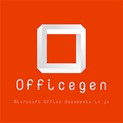
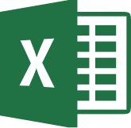

# officegen

Creating Office Open XML files (Word, Excel and Powerpoint) for Microsoft Office 2007 and later without external tools, just pure Javascript.
*officegen* should work on any environment that supports Node.js including Linux, OSX and Windows.
*officegen* also supporting PowerPoint *native* charts objects with embedded data.

[](https://badge.fury.io/js/officegen)
[](https://david-dm.org/Ziv-Barber/officegen)
[](https://david-dm.org/Ziv-Barber/officegen#info&#x3D;devDependencies)
[](https://travis-ci.org/Ziv-Barber/officegen)
[](https://gitter.im/officegen/Lobby?utm_source=badge&utm_medium=badge&utm_campaign=pr-badge&utm_content=badge) 
[](#backers) [](#sponsors) 




- [Getting Started](#getstart)
  - [Installation](#install)
  - [Getting Started with PowerPoint](#getspptx)
  - [Getting Started with Word](#getsdocx)
  - [Getting Started with Excel](#getsxlsx)
- [Full documentation](manual/README.md)
- [Support](#support)
- [The source code](#code)
- [Credit](#credit)
- [Contributors](#contributors)
- [Backers](#backers)
- [Sponsors](#sponsors)

## Contributors:

This project exists thanks to all the people who contribute.

<a name="getstart"></a>
## Getting Started: ##




### Officegen features overview:

- Generating Microsoft PowerPoint document (.pptx file):
  - Create PowerPoint document with one or more slides.
  - Support both PPT and PPS.
  - Can create native charts.
  - Add text blocks.
  - Add images.
  - Can declare fonts, alignment, colors and background.
  - You can rotate objects.
  - Support shapes: Ellipse, Rectangle, Line, Arrows, etc.
  - Support hidden slides.
  - Support automatic fields like date, time and current slide number.
  - Support speaker notes.
  - Support slide layouts.
- Generating Microsoft Word document (.docx file):
  - Create Word document.
  - You can add one or more paragraphs to the document and you can set the fonts, colors, alignment, etc.
  - You can add images.
  - Support header and footer.
  - Support bookmarks and hyperlinks.
- Generating Microsoft Excel document (.xlsx file):
  - Create Excel document with one or more sheets. Supporting cells with either numbers or strings.

<a name="install"></a>
### Installation:

```bash
$ npm install officegen
```

<a name="getspptx"></a>
### Microsoft PowerPoint basic usage example:

```js
const officegen = require('officegen')
const fs = require('fs')

// Create an empty PowerPoint object:
let pptx = officegen('pptx')

// Let's add a title slide:

let slide = pptx.makeTitleSlide('Officegen', 'Example to a PowerPoint document')

// Pie chart slide example:

slide = pptx.makeNewSlide()
slide.name = 'Pie Chart slide'
slide.back = 'ffff00'
slide.addChart(
  {
    title: 'My production',
    renderType: 'pie',
    data:
	[
      {
        name: 'Oil',
        labels: ['Czech Republic', 'Ireland', 'Germany', 'Australia', 'Austria', 'UK', 'Belgium'],
        values: [301, 201, 165, 139, 128,  99, 60],
        colors: ['ff0000', '00ff00', '0000ff', 'ffff00', 'ff00ff', '00ffff', '000000']
      }
    ]
  }
)

// Let's generate the PowerPoint document into a file:

return new Promise((resolve, reject) => {
  let out = fs.createWriteStream('example.pptx')

  // This one catch only the officegen errors:
  pptx.on('error', function(err) {
    reject(err)
  })

  // Catch fs errors:
  out.on('error', function(err) {
    reject(err)
  })

  // End event after creating the PowerPoint file:
  out.on('close', function() {
    resolve()
  })

  // This async method is working like a pipe - it'll generate the pptx data and put it into the output stream:
  pptx.generate(out)
})
```

Since that officegen is using node.js events you can also create a document directly into a http respons stream:

```
const officegen = require('officegen')
const http = require('http')

/**
 * This is a simple web server that response with a PowerPoint document.
 */
http.createServer(function(req, res) {
  // We'll send a generated on the fly PowerPoint document without using files:
  if (req.url == '/') {
    // Create an empty PowerPoint object:
    let pptx = officegen('pptx')

    // Let's create a new slide:
    var slide = pptx.makeNewSlide()

    slide.name = 'Hello World'

    // Change the background color:
    slide.back = '000000'

    // Declare the default color to use on this slide:
    slide.color = 'ffffff'

    // Basic way to add text string:
    slide.addText('Created on the fly using a http server!')

    //
    // Let's generate the PowerPoint document directly into the response stream:
    //

    response.writeHead(200, {
      'Content-Type':
        'application/vnd.openxmlformats-officedocument.presentationml.presentation',
      'Content-disposition': 'attachment filename=out.pptx'
    })

	// Content types related to Office documents:
    // .xlsx   application/vnd.openxmlformats-officedocument.spreadsheetml.sheet
    // .xltx   application/vnd.openxmlformats-officedocument.spreadsheetml.template
    // .potx   application/vnd.openxmlformats-officedocument.presentationml.template
    // .ppsx   application/vnd.openxmlformats-officedocument.presentationml.slideshow
    // .pptx   application/vnd.openxmlformats-officedocument.presentationml.presentation
    // .sldx   application/vnd.openxmlformats-officedocument.presentationml.slide
    // .docx   application/vnd.openxmlformats-officedocument.wordprocessingml.document
    // .dotx   application/vnd.openxmlformats-officedocument.wordprocessingml.template
    // .xlam   application/vnd.ms-excel.addin.macroEnabled.12
    // .xlsb   application/vnd.ms-excel.sheet.binary.macroEnabled.12

    // This one catch only the officegen errors:
    pptx.on('error', function(err) {
      res.end(err)
    })

    // Catch response errors:
    res.on('error', function(err) {
      res.end(err)
    })

    // End event after sending the PowerPoint data:
    res.on('finish', function() {
      res.end()
    })

    // This async method is working like a pipe - it'll generate the pptx data and pass it directly into the output stream:
    pptx.generate(res)
  } else {
    res.end('Invalid Request!')
  } // Endif.
}).listen(3000)
```

### Where to go from here?

- For more information please refer to the [full documentation](manual/README.md).
- For some examples please [click here](#examples).

<a name="getspptx"></a>
### Microsoft Word basic usage example:

```js
const officegen = require('officegen')
const fs = require('fs')

// Create an empty Word object:
let docx = officegen('docx')

// Officegen calling this function after finishing to generate the docx document:
docx.on('finalize', function(written) {
  console.log(
    'Finish to create a Microsoft Word document.'
  )
})

// Officegen calling this function to report errors:
docx.on('error', function(err) {
  console.log(err)
})

// Create a new paragraph:
let pObj = docx.createP()

pObj.addText('Simple')
pObj.addText(' with color', { color: '000088' })
pObj.addText(' and back color.', { color: '00ffff', back: '000088' })

pObj = docx.createP()

pObj.addText('Since ')
pObj.addText('officegen 0.2.12', {
  back: '00ffff',
  shdType: 'pct12',
  shdColor: 'ff0000'
}) // Use pattern in the background.
pObj.addText(' you can do ')
pObj.addText('more cool ', { highlight: true }) // Highlight!
pObj.addText('stuff!', { highlight: 'darkGreen' }) // Different highlight color.

pObj = docx.createP()

pObj.addText('Even add ')
pObj.addText('external link', { link: 'https://github.com' })
pObj.addText('!')

pObj = docx.createP()

pObj.addText('Bold + underline', { bold: true, underline: true })

pObj = docx.createP({ align: 'center' })

pObj.addText('Center this text', {
  border: 'dotted',
  borderSize: 12,
  borderColor: '88CCFF'
})

pObj = docx.createP()
pObj.options.align = 'right'

pObj.addText('Align this text to the right.')

pObj = docx.createP()

pObj.addText('Those two lines are in the same paragraph,')
pObj.addLineBreak()
pObj.addText('but they are separated by a line break.')

docx.putPageBreak()

pObj = docx.createP()

pObj.addText('Fonts face only.', { font_face: 'Arial' })
pObj.addText(' Fonts face and size.', { font_face: 'Arial', font_size: 40 })

docx.putPageBreak()

pObj = docx.createP()

// We can even add images:
pObj.addImage('some-image.png')

// Let's generate the Word document into a file:

let out = fs.createWriteStream('example.docx')

out.on('error', function(err) {
  console.log(err)
})

// Async call to generate the output file:
docx.generate(out)
```

### Where to go from here?

- For more information please refer to the [full documentation](manual/README.md).
- For some examples please [click here](#examples).

<a name="getspptx"></a>
### Microsoft Excel basic usage example:

```js
const officegen = require('officegen')
const fs = require('fs')

// Create an empty Excel object:
let xlsx = officegen('xlsx')

// Officegen calling this function after finishing to generate the xlsx document:
xlsx.on('finalize', function(written) {
  console.log(
    'Finish to create a Microsoft Excel document.'
  )
})

// Officegen calling this function to report errors:
xlsx.on('error', function(err) {
  console.log(err)
})

let sheet = xlsx.makeNewSheet()
sheet.name = 'Officegen Excel'

// Add data using setCell:

sheet.setCell('E7', 42)
sheet.setCell('I1', -3)
sheet.setCell('I2', 3.141592653589)
sheet.setCell('G102', 'Hello World!')

// The direct option - two-dimensional array:

sheet.data[0] = []
sheet.data[0][0] = 1
sheet.data[1] = []
sheet.data[1][3] = 'some'
sheet.data[1][4] = 'data'
sheet.data[1][5] = 'goes'
sheet.data[1][6] = 'here'
sheet.data[2] = []
sheet.data[2][5] = 'more text'
sheet.data[2][6] = 900
sheet.data[6] = []
sheet.data[6][2] = 1972

// Let's generate the Excel document into a file:

let out = fs.createWriteStream('example.xlsx')

out.on('error', function(err) {
  console.log(err)
})

// Async call to generate the output file:
xlsx.generate(out)
```

### Where to go from here?

- For more information please refer to the [full documentation](manual/README.md).
- For some examples please [click here](#examples).

<a name="support"></a>
## Support:

<a name="examples"></a>
### Examples:

- [make_pptx.js](examples/make_pptx.js) - Example how to create PowerPoint 2007 presentation and save it into file.
- [make_xlsx.js](examples/make_xlsx.js) - Example how to create Excel 2007 sheet and save it into file.
- [make_docx.js](examples/make_docx.js) - Example how to create Word 2007 document and save it into file.
- [pptx_server.js](examples/pptx_server.js) - Example HTTP server that generating a PowerPoint file with your name without using files on the server side.

### The official officegen Google Group:

[officegen Google Group](https://groups.google.com/forum/?fromgroups#!forum/node-officegen)

### The officegen Slack team:

[Slack](https://zivbarber.slack.com/messages/officegen/)

### Plans for the next release:

[Trello](<https://trello.com/b/dkaiSGir/officegen-make-office-documents-in-javascript>)

<a name="code"></a>
## :coffee: The source code:

### The project structure:

- office/index.js - The main file.
- office/lib/ - All the sources should be here.
  - basicgen.js - The generic engine to build many type of document files. This module providing the basicgen plugins interface for all the document generator. Any document generator MUST use this plugins API.
  - docplug.js - The document generator plugins interface - optional engine to create plugins API for each document generator.
  - msofficegen.js - A template basicgen plugin to extend the default basicgen module with the common Microsoft Office stuff. All the Microsoft Office based document generators in this project are using this template plugin.
  - genpptx.js - A document generator (basicgen plugin) to create a PPTX/PPSX document.
  - genxlsx.js - A document generator (basicgen plugin) to create a XLSX document.
  - gendocx.js - A document generator (basicgen plugin) to create a DOCX document.
  - pptxplg-*.js - docplug based plugins for genpptx.js ONLY to implement Powerpoint based features.
  - docxplg-*.js - docplug based plugins for genpptx.js ONLY to implement Word based features.
  - xlsxplg-*.js - docplug based plugins for genpptx.js ONLY to implement Excel based features.
- officegen/test/ - All the unit tests.
- Gruntfile.js - Grunt scripts.

### Code documentations:

To create the jsdoc documentation:

```bash
grunt jsdoc
```

### External dependencies:

This project is using the following awesome libraries/utilities/services:

- archiver
- jszip
- lodash
- xmlbuilder

### How to add new features:

The easiest way to add new features is by using the officegen internal [plugins system](manual/advanced/plugins/README.md).

<a name="credits"></a>
## Credit:

- Created by Ziv Barber in 2013.
- For creating zip streams i'm using 'archiver' by cmilhench, dbrockman, paulj originally inspired by Antoine van Wel's zipstream.

<a name="contributors"></a>
## Contributors:

This project exists thanks to all the people who contribute. 

<a href="https://github.com/Ziv-Barber/officegen/graphs/contributors"></a>

<a name="backers"></a>
## Backers:

Thank you to all our backers! 🙏 [[Become a backer](https://opencollective.com/officegen#backer)]

<a href="https://opencollective.com/officegen#backers" target="_blank"></a>

<a name="sponsors"></a>
## Sponsors:

Support this project by becoming a sponsor. Your logo will show up here with a link to your website. [[Become a sponsor](https://opencollective.com/officegen#sponsor)]

<a href="https://opencollective.com/officegen/sponsor/0/website" target="_blank"></a>
<a href="https://opencollective.com/officegen/sponsor/1/website" target="_blank"></a>
<a href="https://opencollective.com/officegen/sponsor/2/website" target="_blank"></a>
<a href="https://opencollective.com/officegen/sponsor/3/website" target="_blank"></a>
<a href="https://opencollective.com/officegen/sponsor/4/website" target="_blank"></a>
<a href="https://opencollective.com/officegen/sponsor/5/website" target="_blank"></a>
<a href="https://opencollective.com/officegen/sponsor/6/website" target="_blank"></a>
<a href="https://opencollective.com/officegen/sponsor/7/website" target="_blank"></a>
<a href="https://opencollective.com/officegen/sponsor/8/website" target="_blank"></a>
<a href="https://opencollective.com/officegen/sponsor/9/website" target="_blank"></a>
